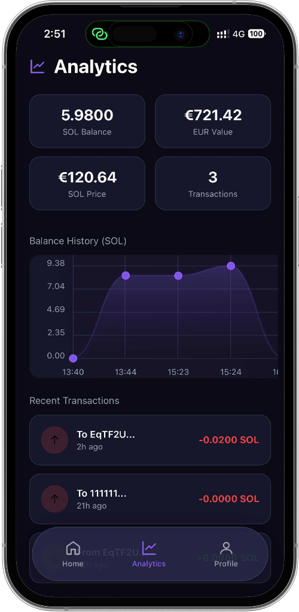
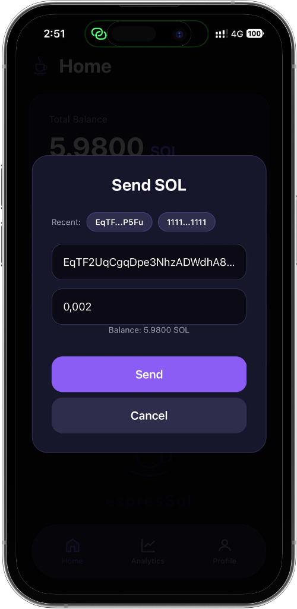
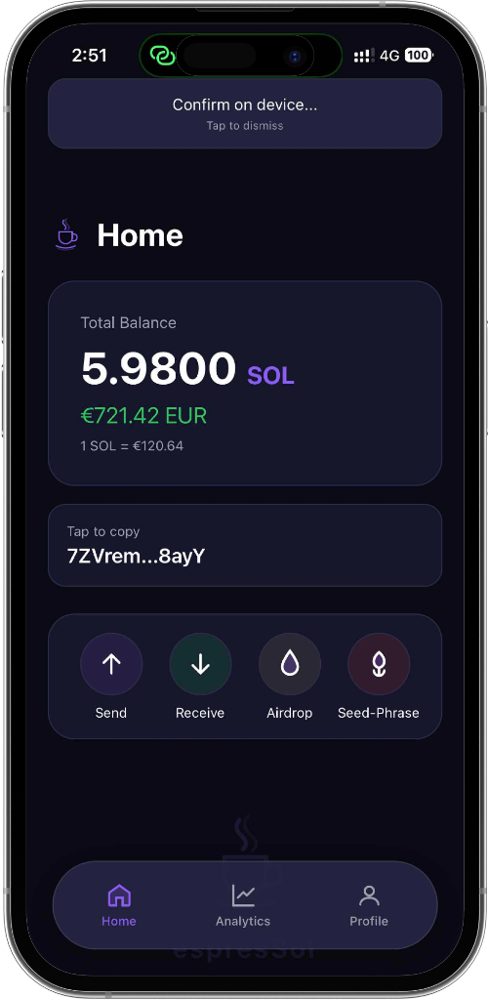
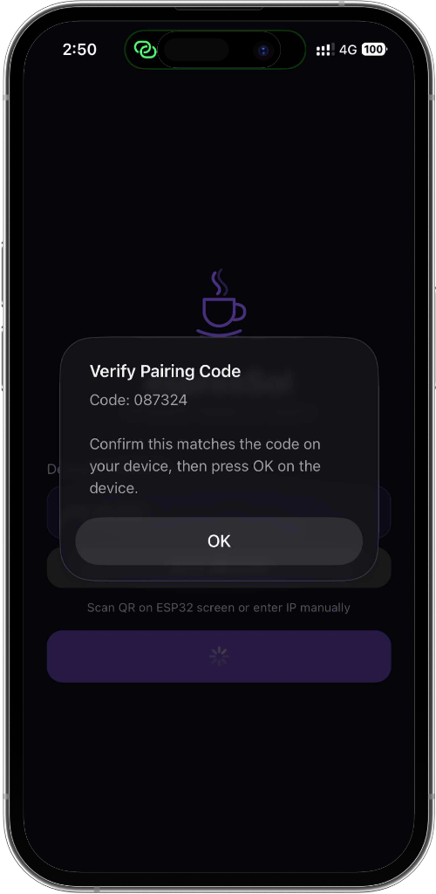

# espresSol - DIY Hardware Wallet 🔐

A secure Solana hardware wallet using ESP32 with Ed25519 signing, encrypted communication, and multi-factor authentication.


## Features

###  Security
- **6-digit PIN** with 100,000 PBKDF2 iterations
- **PIN brute force protection** - exponential backoff + device wipe after 10 fails
- **Session timeout** - auto-locks after 5 minutes
- **Sign rate limiting** - max 5 transactions/minute  
- **Boot integrity check** - detects firmware tampering
- **Per-device TLS certificates** - generated on first boot

###  Cryptography
- **Ed25519** digital signatures (TweetNaCl)
- **BIP39** 12-word mnemonic backup
- **SLIP-0010** Solana-compatible key derivation
- **AES-128-GCM** encrypted key storage
- **Hardware TRNG** for cryptographic randomness

###  Communication
- **USB**: ECDH key exchange + AES-GCM encryption
- **WiFi**: TLS 1.2/1.3 with per-device certificates
- **Mobile**: WebSocket + ECDH + pairing code verification

---

## Screenshots

### Mobile App

<p align="center">
  &nbsp;&nbsp;&nbsp;&nbsp;
  &nbsp;&nbsp;&nbsp;&nbsp;
  
</p>
<p align="center">
  <em>Home</em>&nbsp;&nbsp;&nbsp;&nbsp;&nbsp;&nbsp;&nbsp;&nbsp;&nbsp;&nbsp;&nbsp;&nbsp;&nbsp;&nbsp;&nbsp;&nbsp;&nbsp;&nbsp;&nbsp;&nbsp;&nbsp;&nbsp;&nbsp;&nbsp;&nbsp;&nbsp;&nbsp;&nbsp;&nbsp;&nbsp;
  <em>Analytics</em>&nbsp;&nbsp;&nbsp;&nbsp;&nbsp;&nbsp;&nbsp;&nbsp;&nbsp;&nbsp;&nbsp;&nbsp;&nbsp;&nbsp;&nbsp;&nbsp;&nbsp;&nbsp;&nbsp;&nbsp;&nbsp;&nbsp;&nbsp;&nbsp;&nbsp;&nbsp;&nbsp;&nbsp;&nbsp;&nbsp;
  <em>Send SOL</em>
</p>

<p align="center">
  &nbsp;&nbsp;&nbsp;&nbsp;
  
</p>
<p align="center">
  <em>Device Confirmation</em>&nbsp;&nbsp;&nbsp;&nbsp;&nbsp;&nbsp;&nbsp;&nbsp;&nbsp;&nbsp;&nbsp;&nbsp;&nbsp;&nbsp;&nbsp;&nbsp;&nbsp;&nbsp;&nbsp;&nbsp;
  <em>Pairing Code</em>
</p>

---

## Requirements

### Hardware
| Component | Description |
|-----------|-------------|
| ESP32 | Any ESP32 board with WiFi (ESP32-WROOM recommended) |
| OLED Display | 128x64 I2C SSD1306 |
| Buttons | 4x momentary push buttons |

### Software

#### ESP32 Firmware
- Arduino IDE 2.0+ or PlatformIO
- ESP32 board package 2.x+
- Required libraries:
  - **U8g2** (OLED display)
  - **ArduinoJson** (JSON parsing)
  - **WebSocketsServer** (mobile connectivity)

#### PC Application
- Python 3.8+
- Dependencies in `pc_app/requirements.txt`

#### Mobile Application
- Node.js 18+
- Expo CLI

---

## Quick Start

### 1. Flash ESP32 Firmware

```bash
# Using Arduino IDE
1. Open wallet_main/wallet_main.ino
2. Install libraries: Sketch → Include Library → Manage Libraries
   - U8g2
   - ArduinoJson
   - WebSocketsServer
3. Select ESP32 board
4. Upload!
```

The device will:
- Generate unique TLS certificate on first boot (~30-60 seconds)
- Prompt you to set a 6-digit PIN
- Generate and display 12-word recovery phrase

### 2. Wire Hardware

```
ESP32 Pinout:
┌─────────────────────────────┐
│  OLED (I2C)                 │
│  SDA → GPIO 21              │
│  SCL → GPIO 22              │
│  VCC → 3.3V                 │
│  GND → GND                  │
├─────────────────────────────┤
│  Buttons (to GND)           │
│  OK    → GPIO 4  (White)    │
│  DOWN  → GPIO 23 (Red)      │
│  UP    → GPIO 19 (Blue)     │
│  BACK  → GPIO 18 (Blue)     │
└─────────────────────────────┘
```

### 3. Run PC Application

```bash
cd pc_app

# Install dependencies
pip install -r requirements.txt

# Edit config with your ESP32's IP
# (shown on device screen when in WiFi mode)
notepad config.json  # Windows
nano config.json     # Linux/Mac

# Run wallet
python wallet_cli.py
```

**Or use the launcher scripts:**
- Windows: Double-click `START_WALLET.bat`
- Linux/Mac: `./START_WALLET.sh`

### 4. Run Mobile Application

```bash
cd gui_wallet

# Install dependencies
npm install

# Start Expo
npm start
```

---

## Configuration

### PC App (pc_app/config.json)
```json
{
    "esp32_ip": "192.168.1.100",  // Your ESP32's IP
    "port": 8443,
    "use_tls": true,
    "rpc_url": "https://api.devnet.solana.com"
}
```

### WiFi Setup
WiFi credentials are configured through the device menu or via USB command.

---

## Usage

### First Boot
1. Power on ESP32
2. Wait for certificate generation (~30-60 seconds)
3. Set 6-digit PIN (UP/DOWN to change, OK to confirm)
4. Confirm PIN
5. **Write down the 12-word mnemonic backup!**

### Normal Boot
1. Enter 6-digit PIN
2. Select connection mode (USB/WiFi)
3. Connect with PC or mobile app

### Emergency Wipe
Hold **OK + BACK** buttons for 3 seconds to wipe all data.

---

## Security Architecture

| Feature | Implementation |
|---------|----------------|
| Key Storage | AES-128-GCM encrypted with PIN |
| Key Derivation | PBKDF2 (100,000 SHA256 iterations) |
| USB Encryption | ECDH P-256 + AES-GCM |
| WiFi Encryption | TLS 1.2 + per-device certificates |
| Mobile Encryption | ECDH P-256 + AES-GCM + pairing code |
| PIN Protection | Exponential backoff, wipe after 10 fails |
| Session Security | 5-minute timeout, rate limiting |

### Certificate Generation
Each device generates its own RSA 2048-bit key and X.509 certificate on first boot:
- Uses ESP32 hardware TRNG for randomness
- Stored in NVS (non-volatile storage)
- No secrets in source code

---

## File Structure

```
DIY_Hardware_Wallet/
├── wallet_main/              # ESP32 firmware
│   ├── wallet_main.ino       # Main firmware
│   ├── security_hardening.h  # PIN/session/rate limiting
│   ├── boot_integrity.h      # Firmware verification
│   ├── transaction_parser.h  # TX display
│   ├── cert_generator.h      # Per-device TLS certs
│   ├── key_storage.h         # Encrypted key management
│   └── crypto/               # Ed25519, BIP39, SLIP-0010
├── pc_app/                   # Python PC client
│   ├── wallet_cli.py         # Main CLI
│   ├── secure_channel.py     # AES-GCM encryption
│   ├── comm_selector.py      # USB/WiFi connection
│   └── requirements.txt      # Python dependencies
├── gui_wallet/               # React Native mobile app
│   ├── src/services/         # Wallet & crypto services
│   └── package.json          # Node dependencies
└── README.md
```

---

## Troubleshooting

| Problem | Solution |
|---------|----------|
| "Connection refused" | Check ESP32 IP in config.json |
| "Certificate error" | First connection prompts for TOFU approval |
| "Wrong PIN" lockout | After 10 fails, device wipes - restore from mnemonic |
| USB not detected | Install CH340/CP2102 drivers |
| Compilation errors | Install all Arduino libraries, use ESP32 board 2.x+ |

---

## Contributing

Contributions welcome! Please ensure:
- No hardcoded secrets or credentials
- Security-conscious code review
- Test on actual hardware

---

## License

MIT License - See LICENSE file

---

## Disclaimer

This is a DIY project for educational purposes. Use at your own risk. For significant funds, consider using established hardware wallets with formal security audits.
